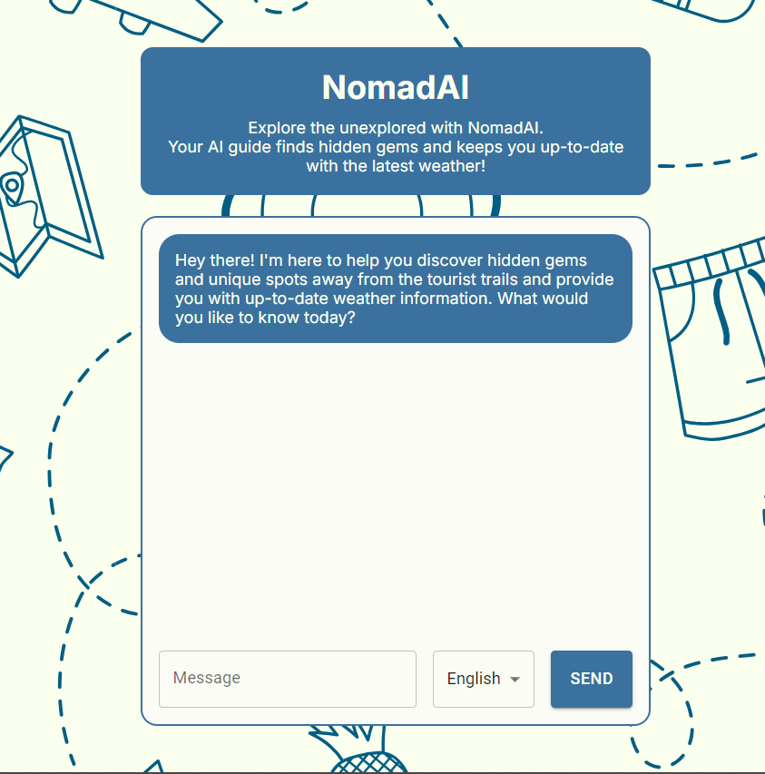

# NomadAI

**NomadAI** is an AI-powered travel assistant that helps you uncover secret travel destinations and provides up-to-date weather information for any location you desire.

## Features

- **Unique Travel Destinations**: Get recommendations for hidden gems and off-the-beaten-path locations.
- **Current Weather Information**: Receive real-time weather updates for any place around the world.
- **Multi-Language Support**: Interact with the assistant in English, Spanish, or Italian.
- **LLM Orchestration**: Uses Google Generative AI to deliver engaging and contextually relevant responses.
- **Weather API Integration**: Fetches current weather details using the Tomorrow.io Weather API.

## Technologies Used

- [Next.js](https://nextjs.org/docs): A React framework for server-side rendering and static site generation.
- [Material UI](https://mui.com/getting-started/installation/): A popular React UI framework for building modern, responsive designs.
- [Google Generative AI](https://cloud.google.com/ai): Provides intelligent and creative responses.
- [Tomorrow.io Weather API](https://www.tomorrow.io/weather-api): Delivers accurate and current weather data.

## License

This project is licensed under the [MIT](LICENSE)

